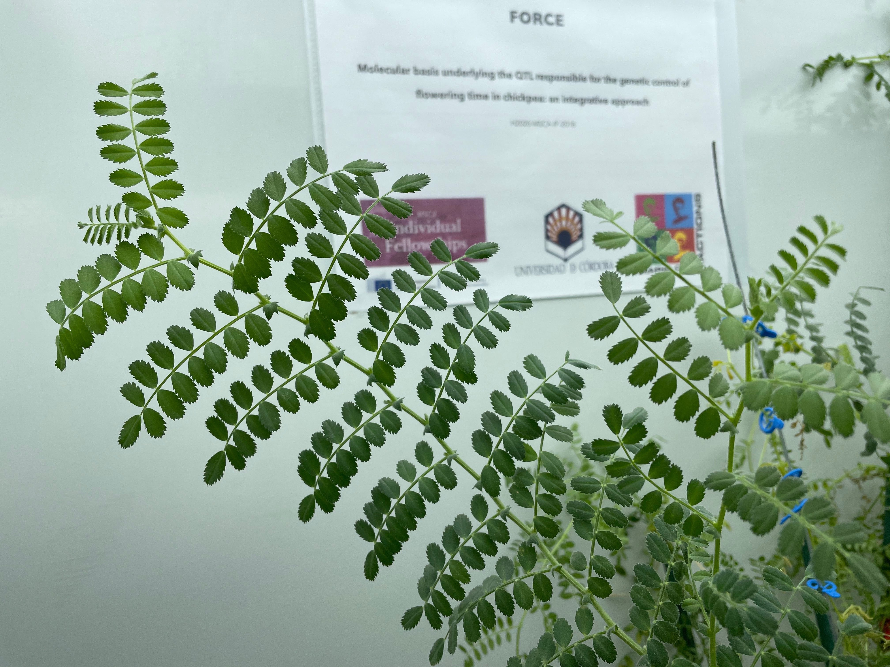

## Summary

Flowering time involves the transition from vegetative growth to the flowering state and it
refers to the number of days from sowing to the appearance of the first fully opened flower.
Flowering time is the major domestication trait defining the adaptation of chickpea to
different agro-climatic conditions, and therefore is a major determinant of its productivity.
Despite early flowering time being suggested as a means to increase chickpea adaptability
roughly 45 years ago , studies on the genetic control of flowering time have appeared only
within the 21st century. Although classical genetic analyses have provided a wealth of
valuable information, the molecular identities of genes underlying the major flowering time
locus remains mostly elusive.


### Objective

Our ability to feed the world with innovative products depends on new breeding methods and technologies that will require well-trained plant breeders who understand fieldwork, skilled scientist who understand the genetic basis of the traits to improve and data scientist to help geneticist and breeders to make more informed material selections. Flowering time is the major domestication trait defining the adaptation of chickpea to different agro-climatic conditions, and therefore is a major determinant of its productivity. Understanding how individual genetic variants combine to provide adaptation in specific situations is fundamental to accelerating introgression of new traits into adapted backgrounds. Today a number of genomic resources developed in the past for model plant systems are available for agronomically important crops. In FLOWERINGCHICKPEA (**FORCE**) we will dissect the molecular basis controlling flowering time. The specific objectives of the project involve:   
  
  a. characterizing a comprehensive inventory of genes controlling flowering time  
  b. constructing the highest-density genetic map available using large-scale mapping populations through a novel genotyping by sequencing strategy  
  c. addressing differential expression profiles for the candidate genes.   


This will be achieved by adopting an integrative approach that combines state-of-the-art technologies in next-generation sequencing, computational plant biology and diverse genetic resources exhibiting a wide range of phenotypic diversity for flowering time. This will allow us the construction of high- density integrated physical and genetic linkage maps, and eventually the assessment of colocalization between flowering time loci/QTL and flowering time genes. Results will be an important resource for geneticists currently investigating legume phenology around the globe. Moreover, the project could have useful applications in agriculture.


### Call 
H2020-MSCA-IF-2018  
MSCA-IF-EF-RI - RI – Reintegration panel  
Funded by [European Comission](https://cordis.europa.eu/project/id/844431)  





```markdown
Syntax highlighted code block

# Header 1
## Header 2
### Header 3

- Bulleted
- List

1. Numbered
2. List

**Bold** and _Italic_ and `Code` text

[Link](url) and 
```


### Jekyll Themes

Your Pages site will use the layout and styles from the Jekyll theme you have selected in your [repository settings](https://github.com/jdieramon/FORCE/settings/pages). The name of this theme is saved in the Jekyll `_config.yml` configuration file.

### Contact

Having trouble with this site ? Check out our [website](https://jdieramon.github.io/) and we’ll help you sort it out.
